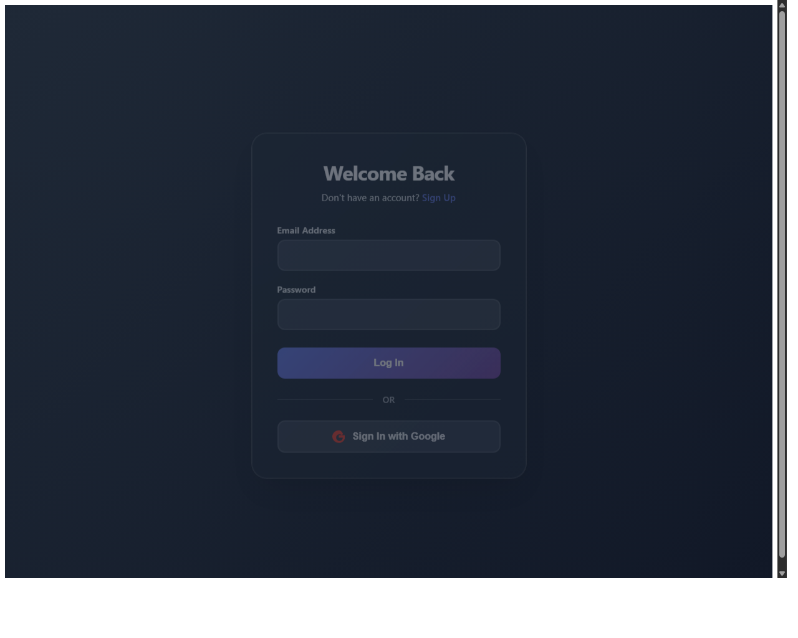

# My Blog App

Welcome to **My Blog App**, a feature-rich, responsive blogging platform engineered with modern web technologies. This application offers a seamless experience for reading, creating, and managing content, backed by a robust Firebase infrastructure.

## 🚀 Features

### Core Functionality
-   **🔐 Secure Authentication**: Full user signup and login flows powered by `Firebase Authentication`, ensuring secure access control.
-   **📝 Rich Content Creation**: Integrated TinyMCE editor allowing for rich text formatting, image embedding, and advanced styling in blog posts.
-   **⚡ Real-time Synchronization**: Instant data updates across all clients using `Cloud Firestore` listeners.
-   **📱 Responsive & Adaptive**: Mobile-first design philosophy implemented with `Tailwind CSS`, ensuring a consistent experience on all devices.

### User Experience
-   **Dashboard**: A centralized hub for users to manage their posts, view stats, and update profiles.
-   **Category System**: Organized content browsing through dynamic category pages.
-   **Social Interaction**: (Planned) Features for liking, commenting, and sharing posts.

## 🛠️ Technology Stack & Architecture

### Frontend
-   **Framework**: [React v19](https://react.dev/) - The latest version for building user interfaces.
-   **Build Tool**: [Vite](https://vitejs.dev/) - Ensuring lightning-fast development server start and hot module replacement (HMR).
-   **Styling**: [Tailwind CSS](https://tailwindcss.com/) - Utility-first CSS framework for rapid UI development.
-   **Icons**: [Lucide React](https://lucide.dev/) - Beautiful, consistent icons.
-   **State Management**: React Context API (`AuthContext`) for global user state.
-   **Routing**: [React Router DOM v7](https://reactrouter.com/) - Client-side routing with protected route implementation.

### Backend & Infrastructure (Serverless)
-   **Platform**: [Firebase](https://firebase.google.com/)
-   **Database**: **Cloud Firestore** - NoSQL document database for flexible, scalable data storage.
-   **Authentication**: **Firebase Auth** - Handling identity management.
-   **Storage**: **Firebase Storage** - Securely storing user uploads (profile pictures, post images).
-   **Hosting**: **Firebase Hosting** - Fast and secure content delivery.

## 📂 Folder Structure

The project follows a scalable feature-based structure:

\`\`\`
my-blog-app/
├── public/                 # Static assets
│   └── assets/images/      # Project screenshots and illustrations
├── src/
│   ├── components/         # Reusable UI components
│   │   ├── Navbar.jsx      # Main navigation
│   │   ├── MainLayout.jsx  # Layout wrapper
│   │   └── ...
│   ├── context/            # Global state context providers
│   │   └── AuthContext.jsx # Authentication state logic
│   ├── pages/              # Application views/routes
│   │   ├── HomePage.jsx    # Main feed
│   │   ├── PostEditor.jsx  # Blog post creation tool
│   │   ├── Login.jsx       # Auth pages
│   │   └── ...
│   ├── firebase/           # Firebase configuration and initialization
│   ├── App.jsx             # Main application component & Routing setup
│   └── main.jsx            # Entry point
├── dist/                   # Production build output
├── firebase.json           # Firebase Hosting configuration
└── package.json            # Project dependencies and scripts
\`\`\`

## 📸 Screenshots

### Home Page

### Login Page

## 📦 Getting Started

### Prerequisites
-   **Node.js**: v16.0.0 or higher
-   **npm**: v7.0.0 or higher
-   **Firebase Account**: Required for backend services.

### Installation & Setup

1.  **Clone the Repository**
    \`\`\`bash
    git clone https://github.com/your-username/my-blog-app.git
    cd my-blog-app
    \`\`\`

2.  **Install Dependencies**
    \`\`\`bash
    npm install
    # or
    yarn install
    \`\`\`

3.  **Environment Configuration**
    Create a \`.env\` file in the root directory. You can use \`.env.example\` as a reference (if available). Add your Firebase configuration keys:
    \`\`\`env
    VITE_FIREBASE_API_KEY=your_api_key
    VITE_FIREBASE_AUTH_DOMAIN=your_project.firebaseapp.com
    VITE_FIREBASE_PROJECT_ID=your_project_id
    VITE_FIREBASE_STORAGE_BUCKET=your_bucket.appspot.com
    VITE_FIREBASE_MESSAGING_SENDER_ID=your_sender_id
    VITE_FIREBASE_APP_ID=your_app_id
    \`\`\`

4.  **Run Development Server**
    \`\`\`bash
    npm run dev
    \`\`\`
    Open [http://localhost:5173](http://localhost:5173) in your browser.

## 🚀 Deployment

This project is configured for **Firebase Hosting**.

### 1. Build for Production
Create an optimized production build:
\`\`\`bash
npm run build
\`\`\`
This will generate the static files in the \`dist/\` directory.

### 2. Deploy to Firebase
Ensure you have the Firebase CLI installed and are logged in:
\`\`\`bash
npm install -g firebase-tools
firebase login
\`\`\`

Initialize the project (if not already done):
\`\`\`bash
firebase init hosting
# Select "Use an existing project" -> Choose your project
# Public directory: "dist"
# Configure for single-page app: "Yes"
\`\`\`

Deploy to the live URL:
\`\`\`bash
firebase deploy --only hosting
\`\`\`

## 📜 License

This project is licensed under the MIT License - see the [LICENSE](LICENSE) file for details.
